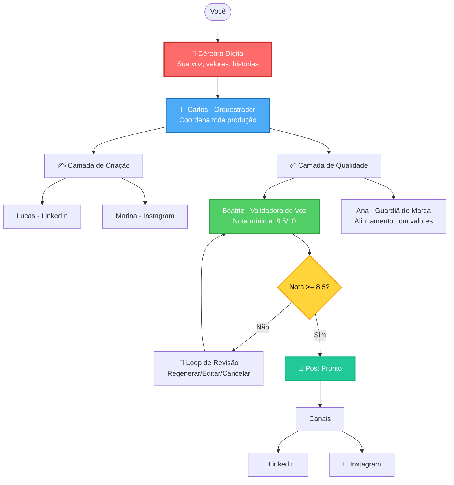

# Content Foundry

> Sistema de produção de conteúdo autêntico para Founders usando IA

[](https://github.com/vitorgarcia/content-foundry)
[](https://github.com/vitorgarcia/content-foundry)

---

## O que é?

**Content Foundry** é um sistema que usa IA para capturar sua voz única e produzir conteúdo autêntico para redes sociais.

Não é consultoria. Não é estratégia. É **produção real de conteúdo** — você recebe posts prontos para publicar que soam genuinamente como você.

---

## Por que existe?

Você, como founder, tem conhecimento valioso e histórias autênticas. Mas falta tempo para transformar isso em conteúdo consistente.

IAs genéricas (ChatGPT, etc) produzem textos sem alma — todo mundo reconhece que foi escrito por robô.

**Content Foundry resolve isso:**
- Captura como você pensa, fala e se posiciona
- Cria um "Cérebro Digital" com sua essência
- Gera conteúdo que soa genuinamente seu
- Valida autenticidade com nota mínima de 8.5/10

---

## Como funciona na prática?

### 1️⃣ Onboarding (apenas uma vez)

O sistema faz perguntas estruturadas para criar seu **Cérebro Digital**:
- Como você fala e escreve
- Suas histórias e experiências
- Seus valores e posicionamento
- Seus temas principais (pilares de conteúdo)
- O que você evita falar (modo de segurança)

**Tempo:** 60-90 minutos

**Resultado:** Um arquivo `brain.md` que funciona como sua "impressão digital de voz"

---

### 2️⃣ Produção de conteúdo (15-20 minutos por post)

**Fluxo do Workflow #3 (Produção Expressa):**

```
Você fornece o tópico
       ↓
Sistema carrega 100% do seu Cérebro Digital
       ↓
Gera 3 variações de post
       ↓
Valida autenticidade (nota >= 8.5/10)
       ↓
Se aprovado: Post pronto para publicar
Se reprovado: Loop de revisão (automático ou manual)
       ↓
Salva com todos os metadados
```

**Canais disponíveis:**
- LinkedIn (posts e artigos)
- Instagram (legendas para feed)

**O que o sistema faz:**
1. Lucas (Escritor LinkedIn) ou Marina (Escritora Instagram) gera o conteúdo
2. Beatriz (Validadora de Voz) verifica autenticidade (10 critérios)
3. Ana (Guardiã de Marca) valida alinhamento com seus valores
4. Sistema aplica 5 camadas de validação de qualidade

**Tempo:** 15-20 minutos do tópico até o post salvo

---

### 3️⃣ Garantia de qualidade

Cada conteúdo passa por **5 camadas de validação** (14 critérios no total):

**Camada 1 - Estrutura** (4 critérios)
- Gancho impactante presente
- Corpo bem estruturado
- CTA conversacional
- Formatação adequada ao canal

**Camada 2 - Tamanho** (2 critérios)
- LinkedIn: 800-1300 caracteres
- Instagram: 800-2000 caracteres

**Camada 3 - Autenticidade** (3 critérios)
- Nota de voz >= 8.5/10 ✅ **Rigoroso**
- Zero chavões de IA/coach
- Dados específicos presentes

**Camada 4 - Alinhamento de Marca** (2 critérios + 4 detalhados)
- Alinhado com seus pilares de conteúdo
- Reflete seus valores
- Validação detalhada: pilares (30%), valores (25%), modo seguro (30%), consistência (15%)

**Camada 5 - Editorial** (3 critérios)
- Modo de segurança respeitado
- Sem erros de português
- Tom profissional mas conversacional

**Resultado:** Apenas conteúdo que passa em **100% dos critérios** é aprovado.

---

## Diferencial: Arquitetura vs Prompt

### ❌ O problema das IAs genéricas

Quando você usa ChatGPT diretamente:
- **Superficial** - Falta profundidade
- **Previsível** - Padrões genéricos óbvios
- **Detectável** - Todo mundo reconhece que é IA
- **Sem personalidade** - Não captura sua voz

### ✅ A solução: Arquitetura em camadas

Content Foundry **não é um prompt melhor**. É uma **arquitetura diferente**.

#### 1. Cérebro Digital (brain.md)
- Captura sua essência completa
- Contexto permanente para todos os agentes
- Quanto mais rico, mais original o conteúdo

#### 2. Agentes especializados (não uma IA genérica)
- Cada agente focado em uma função específica
- Todos carregam 100% do seu Cérebro antes de agir
- Trabalham como uma equipe de marketing

#### 3. Validação rigorosa
- Nota mínima: 8.5/10 de autenticidade
- 5 camadas com 14 critérios
- Loop de revisão automático quando falha

#### 4. Loop de revisão inteligente
- Se nota < 8.5: sistema oferece 3 opções
  - **[A] Regenerar** - Automático (máximo 3 tentativas)
  - **[B] Editar manualmente** - Você edita e re-valida (sem limite)
  - **[C] Cancelar** - Aborta o workflow
- Tracking completo de tentativas
- Feedback específico com exemplos antes/depois

### 📊 O resultado

**Conteúdo original e profundo:**
- Indistinguível de escrita manual
- Com suas histórias e perspectivas únicas
- Alinhado com seus valores
- Nota de autenticidade >= 8.5/10

---

## Arquitetura do sistema



---

## Os agentes do sistema

Cada agente é um especialista com função específica, trabalhando como uma equipe completa de marketing:

### 🎯 Orquestração
- ✅ **Carlos** - Orquestrador que coordena todos os agentes
- ✅ **Elena** - Especialista em elicitação (onboarding)

### ✍️ Criação de conteúdo
- ✅ **Lucas** - Escritor de LinkedIn (posts e artigos)
- ✅ **Marina** - Escritora de Instagram (legendas de feed)
- 🔜 **Criador de Carrosséis** - Carrosséis para Instagram
- 🔜 **Roteirista de Reels** - Roteiros de vídeos curtos
- 🔜 **Roteirista de Vídeo** - Roteiros completos para YouTube
- 🔜 **Escritor de Newsletter** - Emails e newsletters

### ✅ Qualidade e validação
- ✅ **Beatriz** - Validadora de voz (nota mínima 8.5/10)
- ✅ **Ana** - Guardiã de marca (alinhamento com valores)
- 🔜 **Editor** - Revisão gramatical e clareza

### 📊 Estratégia e pesquisa
- 🔜 **Analista de Pesquisa** - Tendências e mercado
- 🔜 **Sofia** - Estrategista de conteúdo (calendário editorial)
- 🔜 **Analista de Audiência** - Perfil e dores da audiência

### 💡 Ideação
- 🔜 **Criador de Ganchos** - Ganchos irresistíveis
- 🔜 **Minerador de Histórias** - Extrai e estrutura suas histórias

### 🔄 Otimização
- 🔜 **Especialista em Reaproveitamento** - Adapta entre canais
- 🔜 **Otimizador de SEO** - Otimização para buscas
- 🔜 **Otimizador de Engajamento** - Melhora CTAs e hooks

**Progresso:** 6 de 20 agentes implementados (30%)

**Legenda:**
- ✅ = Implementado e testado
- 🔜 = Planejado para próximas sprints

---

## Modo de segurança (Safe Mode)

Você define o quanto quer ser ousado no conteúdo:

### 🟢 Conservador
- Tom profissional e suave
- Evita polêmicas e temas sensíveis
- Educativo e inclusivo
- Ideal para: Empresas tradicionais, B2B corporativo

### 🟡 Balanceado (padrão)
- Autêntico com opiniões claras
- Provocação construtiva
- Tópicos amplos mas sensatos
- Ideal para: Maioria dos founders e startups

### 🔴 Ousado
- Opiniões fortes sem filtro
- Provocativo com propósito
- Pode polarizar (mas nunca ofensivo)
- Ideal para: Personal branding forte, nichos específicos

**Cada modo tem:**
- Checklist específico de validação
- Exemplos de conteúdo aprovado/reprovado
- Red flags a evitar

**Validação:** Sistema garante que 100% do conteúdo respeita o modo escolhido.

---

## Adaptação entre canais

O sistema adapta o **formato**, mas mantém a **autenticidade**:

### LinkedIn (Lucas) vs Instagram (Marina)

| Aspecto | LinkedIn | Instagram |
|---------|----------|-----------|
| **Tom** | Profissional-conversacional | Casual-autêntico |
| **Parágrafos** | 2-4 linhas | 1-3 linhas |
| **Emojis** | Raramente | 2-5 estratégicos |
| **Hashtags** | Nenhuma | 8-15 balanceadas |
| **CTA** | Pergunta reflexiva | Convite direto + emoji |
| **Tamanho** | 800-1300 caracteres | 800-2000 caracteres |

### ✅ O que NÃO muda (rigor igual)
- Nota de voz >= 8.5/10
- 100% do Cérebro Digital carregado
- Modo de segurança respeitado
- Zero chavões de IA
- Dados específicos obrigatórios

**Exemplo prático:**

**LinkedIn (Lucas):**
```
Demiti meu melhor vendedor ontem.

Ele batia 180% da meta todo mês há 8 meses.
Comissão de R$ 45k. Queridinho do time.

[5-6 parágrafos de 2-4 linhas]

Você já teve que demitir alguém "bom"
pelos motivos "errados"?
```

**Instagram (Marina):**
```
Demiti meu melhor vendedor ontem.
💔

Ele batia 180% da meta.
R$ 45k de comissão.
Queridinho do time.

[vários parágrafos de 1-3 linhas]

Você já passou por isso?
Conta aqui 👇

━━━

#SaaS #B2BSales #CustomerSuccess [+9 hashtags]
```

**Mantido:** Mesma história, mesmos dados, mesma vulnerabilidade, mesma nota de voz.

---

## Estrutura do projeto

```
content-foundry/
├── .content-foundry/          # Núcleo do sistema
│   ├── agents/                # 20 agentes especializados
│   │   ├── orchestrator.md           # Carlos
│   │   ├── linkedin-writer.md        # Lucas ✅
│   │   ├── instagram-feed-writer.md  # Marina ✅
│   │   ├── voice-validator.md        # Beatriz ✅
│   │   └── brand-guardian.md         # Ana ✅
│   │
│   ├── workflows/             # Fluxos de trabalho
│   │   ├── 01-onboarding.md
│   │   ├── 02-planejamento-mensal.md
│   │   └── 03-producao-express.md    # Produção rápida ✅
│   │
│   ├── tasks/                 # Tarefas reutilizáveis
│   │   ├── gerar-post-linkedin.md
│   │   └── loop-revisao.md           # Loop de revisão ✅
│   │
│   ├── templates/             # Estruturas de conteúdo
│   │   ├── linkedin-post.yaml
│   │   └── instagram-legenda.yaml    # Template Instagram ✅
│   │
│   ├── checklists/            # Validações de qualidade
│   │   ├── pronto-para-publicar-linkedin.md
│   │   ├── brand-alignment-checklist.md  # Alinhamento ✅
│   │   └── safe-mode-check.md            # Modo seguro ✅
│   │
│   ├── tests/                 # Testes automatizados
│   │   └── test-*.md          # 80+ testes (100% pass)
│   │
│   └── config.yaml            # Configuração global
│
├── docs/                      # Seus dados (privado)
│   ├── brain.md               # Seu Cérebro Digital 🧠
│   ├── content/               # Conteúdos gerados
│   │   ├── linkedin/          # Posts LinkedIn
│   │   └── instagram/         # Posts Instagram
│   ├── stories/               # Histórias de desenvolvimento
│   └── calendar.md            # Calendário editorial
│
└── README.md                  # Este arquivo
```

---

## Tecnologias

```yaml
Runtime:
  Plataforma: Claude Code (Anthropic)
  Modelo: Claude Sonnet 4.5
  Método: BMad (config-driven development)

Formato:
  Configuração: YAML + Markdown
  Armazenamento: Sistema de arquivos + Git
  Versionamento: Git (controle total)

Dependências:
  Externas: Nenhuma
  Filosofia: Sistema baseado puramente em configuração
```

**Por que essa stack?**
- **Zero dependências** - Funciona offline
- **Tudo versionado** - Git controla tudo
- **100% auditável** - Você vê cada decisão
- **Portável** - Roda em qualquer máquina com Claude Code

---

## Progresso atual

### ✅ Implementado (Sprint atual)

**Epic 04 - Camadas de Qualidade:**
- ✅ Ana (Guardiã de Marca) com validação de 4 critérios
- ✅ Checklist de alinhamento de marca (score ponderado)
- ✅ Beatriz aprimorada com scoring detalhado YAML
- ✅ Checklist de modo de segurança (3 modos: Conservador/Balanceado/Ousado)
- ✅ Loop de revisão automático (regenerar/editar/cancelar)
- ✅ Testes end-to-end dos 5 gates (6 cenários, 100% cobertura)

**Epic 05 - Canal Instagram:**
- ✅ Marina (Escritora Instagram) com 6 comandos
- ✅ Template de legenda Instagram (5 componentes, 3 exemplos)
- ✅ Adaptação de tom (casual mas autêntico)
- ✅ Sistema de hashtags (8-15, balanceadas amplas/médias/nicho)

**Workflows:**
- ✅ Workflow #3 v1.2.0 (Produção Expressa com loop de revisão)

**Testes:**
- ✅ 80+ testes criados
- ✅ 100% pass rate
- ✅ Cobertura completa de todos os ACs

### 🔜 Próximos passos

**Epic 05 - Instagram (continuar):**
- Task de geração de legenda Instagram
- Workflow #3 adaptado para Instagram
- Template de carrossel Instagram
- Testes de geração de posts Instagram
- Validação de nota de voz consistente entre canais

**Epic 06 - Otimização:**
- Sistema de métricas e analytics
- Biblioteca de ganchos testados
- Otimizador de engajamento

---

## Métricas de validação do MVP

O sistema será considerado validado quando:

- [x] Nota de voz >= 8.5/10 em todos os posts gerados
- [x] Loop de revisão automático funcionando
- [x] 5 camadas de qualidade validadas end-to-end
- [ ] 70%+ dos posts aprovados sem precisar editar
- [ ] Conteúdo indistinguível de escrita manual (validação externa)
- [ ] 30 posts reais gerados e publicados em 4 semanas
- [ ] Tempo médio < 20 minutos do tópico ao post salvo

**Status atual:** 3 de 7 métricas atingidas (43%)

---

## Roadmap

### v1.0 - MVP (atual - Q4 2025)

**Objetivo:** Validar que IA consegue capturar voz autêntica de founders

**O que tem:**
- ✅ Sistema baseado em configuração (BMad Method)
- ✅ 6 agentes especializados implementados
- ✅ 2 canais funcionando (LinkedIn + Instagram)
- ✅ Validação rigorosa (nota >= 8.5/10)
- ✅ Loop de revisão automático
- ✅ 5 camadas de qualidade (14 critérios)
- ✅ 3 modos de segurança
- ✅ 80+ testes automatizados

**Para completar o MVP:**
- 🔜 Mais 14 agentes (de 6 para 20)
- 🔜 Workflows de planejamento e produção em lote
- 🔜 30 posts reais publicados e validados

### v2.0 - Escala (Q1-Q2 2026)

**Objetivo:** Transformar em produto standalone

**O que terá:**
- Aplicativo independente (não precisa de Claude Code)
- Interface web amigável
- Múltiplos founders na mesma empresa
- Sincronização em nuvem
- Mais canais (TikTok, Blog, Podcast, Twitter/X)
- API pública
- Integrações diretas com redes sociais
- Sistema de métricas e analytics

**Quando:** Após validação completa do MVP

---

## Como contribuir (futuro)

**Status atual:** Projeto privado em desenvolvimento ativo.

Quando o MVP for validado, planejamos:
- Abrir código-fonte (licença a definir)
- Aceitar contribuições da comunidade
- Criar documentação completa para desenvolvedores
- Disponibilizar templates e checklists como recursos livres

**Se você é founder e quer testar:** Entre em contato para participar da validação do MVP.

---

## Sobre o projeto

Este é um **projeto experimental** para validar se IA consegue realmente capturar a voz autêntica de um founder e gerar conteúdo de qualidade profissional em escala.

**O foco não é velocidade, é autenticidade.**

Cada post deve soar genuinamente como o founder escreveria — não como um robô genérico tentando imitar.

### Por que importa?

Founders têm expertise valiosa e histórias únicas, mas:
- Criar conteúdo consistente demanda tempo
- Terceirizar perde autenticidade
- IAs genéricas produzem texto detectável

**Content Foundry busca o meio-termo:**
- Escala de IA + Autenticidade humana
- Produção rápida + Qualidade rigorosa
- Automação + Personalização profunda

---

## Desenvolvido por

**Vitor Garcia**
Product Owner & Founder da [Causi](https://causi.com.br/)

Desenvolvido usando **[BMad Method](https://bmad.ai)** — metodologia de desenvolvimento config-driven com IA.

---

## Licença

**Status:** Projeto privado em desenvolvimento.

Licença será definida após validação do MVP.

---

## Contato

**Quer testar o sistema?** Entre em contato para participar da validação do MVP.

**Tem dúvidas sobre a arquitetura?** Veja a [documentação completa](./docs/).

**Quer entender o método de desenvolvimento?** Leia sobre [BMad Method](https://bmad.ai).

---

<div align="center">

**[Documentação](./docs/)** • **[Arquitetura](./docs/architecture/)** • **[Stories](./docs/stories/)**

---

**Feito por founders, para founders.**

*Porque autenticidade não se delega — se automatiza com inteligência.*

</div>
