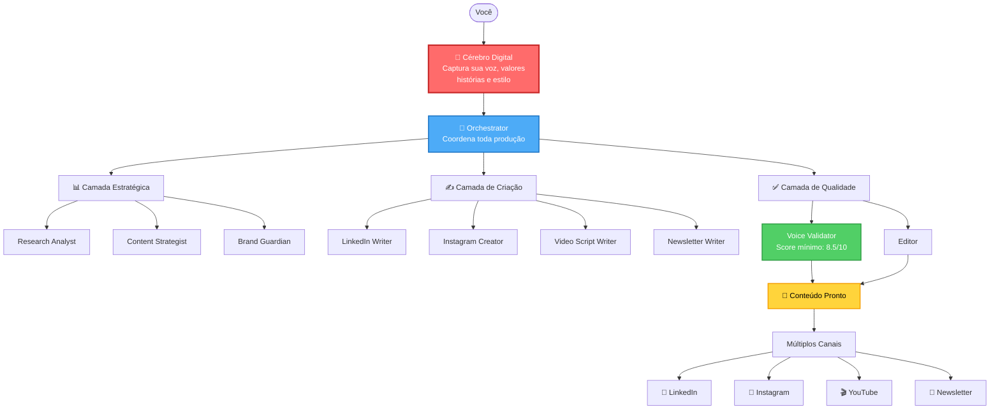

# Content Foundry

> Framework AI-First de produção de conteúdo para Founder-Led Marketing

[](https://github.com/vitorgarcia/content-foundry)
[](https://github.com/vitorgarcia/content-foundry)

---

## O que é

**Content Foundry** é um sistema de produção de conteúdo que usa IA para capturar sua voz única e gerar posts autênticos para redes sociais.

**O diferencial:** Não é consultoria, é produção. Você recebe conteúdo pronto para publicar.

---

## Por que existe

Founders têm conhecimento valioso e histórias autênticas, mas falta tempo para criar conteúdo consistente. IAs genéricas produzem textos sem alma.

Content Foundry resolve isso criando um "Cérebro Digital" que entende como você pensa, fala e se posiciona - e usa isso para gerar conteúdo que soa genuinamente seu.

---

## Como é diferente

### O problema das LLMs genéricas

Quando você usa ChatGPT ou outras IAs diretamente, o conteúdo gerado é:
- **Superficial** - Falta profundidade e contexto específico
- **Previsível** - Usa padrões genéricos facilmente identificáveis
- **Detectável** - Ferramentas e leitores reconhecem como "escrito por IA"
- **Sem personalidade** - Não captura sua voz única

### A solução: arquitetura em camadas

Content Foundry não é um prompt único enviado para uma LLM. É uma arquitetura com múltiplas camadas de processamento:

**1. Cérebro Digital**
- Captura sua essência: voz, valores, histórias, estilo
- Funciona como contexto permanente para todos os agentes
- Quanto mais rico o cérebro, mais original o conteúdo

**2. Camada Estratégica**
- Analisa contexto, trends e audiência antes de criar
- Garante alinhamento com seus valores e posicionamento
- Evita conteúdo genérico ou fora do seu tom

**3. Camada de Criação**
- Múltiplos agentes especializados (não uma IA genérica)
- Cada um focado em um tipo de conteúdo específico
- Carrega 100% do Cérebro Digital antes de gerar

**4. Camada de Ideação**
- Extrai suas histórias pessoais e as estrutura
- Cria ganchos únicos baseados na sua experiência
- Evita clichês e chavões de coach genérico

**5. Camada de Qualidade**
- Voice Validator analisa autenticidade (score mínimo 8.5/10)
- Brand Guardian verifica alinhamento com valores
- Editor revisa clareza e estrutura

**6. Camada de Otimização**
- Refina hooks e CTAs sem perder autenticidade
- Otimiza para engajamento mantendo sua voz
- Adapta conteúdo entre canais preservando essência

### O resultado

**Conteúdo original e profundo:**
- Indistinguível de escrita manual
- Com suas histórias e perspectivas únicas
- Alinhado com seus valores
- Score de autenticidade >= 8.5/10

**Não é um prompt melhor. É uma arquitetura diferente.**

---

## Como funciona



---

## Os 20 agentes especializados

Cada agente é um especialista com função específica, trabalhando como uma equipe de marketing completa:

### Orquestração e fundação
- ✅ **Carlos (Orchestrator)** - Coordena todos os agentes e distribui tarefas
- ✅ **Elena (Elicitation Expert)** - Conduz o onboarding e captura sua essência

### Estratégia e pesquisa
- 🔜 **Research Analyst** - Pesquisa profunda sobre trends, notícias e mercado
- 🔜 **Sofia (Content Strategist)** - Cria calendário editorial e estratégia
- ✅ **Ana (Brand Guardian)** - Garante alinhamento com seus valores
- 🔜 **Audience Insights** - Analisa sua audiência e suas dores

### Ideação
- 🔜 **Hook Creator** - Cria ganchos irresistíveis que param o scroll
- 🔜 **Storytelling Miner** - Extrai e estrutura suas histórias pessoais

### Produção de conteúdo
- ✅ **Lucas (LinkedIn Writer)** - Escreve posts e artigos para LinkedIn
- 🔜 **Marina (Instagram Feed Writer)** - Cria legendas para feed do Instagram
- 🔜 **Instagram Carousel Creator** - Desenvolve carrosséis educativos
- 🔜 **Reels Script Writer** - Roteiros para Reels e vídeos curtos
- 🔜 **Stories Strategist** - Briefings para Stories do Instagram
- 🔜 **Video Script Writer** - Roteiros completos para YouTube
- 🔜 **Newsletter Writer** - Escreve newsletters e emails

### Qualidade e revisão
- 🔜 **Editor/Proofreader** - Revisa gramática e clareza
- ✅ **Beatriz (Voice Validator)** - Valida autenticidade (score mínimo 8.5/10)

### Otimização
- 🔜 **Repurposing Specialist** - Adapta conteúdo entre canais
- 🔜 **SEO Optimizer** - Otimiza para mecanismos de busca
- 🔜 **Engagement Optimizer** - Melhora hooks, CTAs e engajamento

**Legenda:**
- ✅ = Implementado e funcionando
- 🔜 = Planejado para próximas sprints

**Progresso atual:** 5 de 20 agentes (25%)

---

## Funcionamento prático

### 1. Onboarding (primeira vez)

O sistema guia você por perguntas estruturadas para criar seu "Cérebro Digital":
- Como você fala e escreve
- Suas histórias e experiências
- Seus valores e posicionamento
- Seus temas principais (pilares de conteúdo)

**Tempo:** 60-90 minutos

### 2. Gerar conteúdo

Depois do onboarding, você pode gerar posts em minutos:
- Sistema carrega 100% do seu Cérebro Digital
- Gera 3 variações de conteúdo
- Valida autenticidade (Voice Score >= 8.5/10)
- Entrega pronto para publicar

**Tempo por post:** 15-20 minutos

### 3. Garantia de qualidade

Cada conteúdo passa por validação rigorosa:
- ✅ Soa genuinamente como você
- ✅ Alinhado com seus valores
- ✅ Dentro do seu nível de ousadia configurado
- ✅ Qualidade editorial

---

## Canais suportados

### Disponíveis agora (v1.0)

- **LinkedIn** - Posts, artigos, carrosséis
- **Instagram** - Feed, carrossel, Reels, Stories
- **YouTube** - Roteiros de vídeos
- **Newsletter** - Email marketing

### Próximos canais (v2.0)

- TikTok
- Blog/Website
- Podcast
- Twitter/X

---

## Roadmap

### v1.0 - MVP (atual)

**Status:** ✅ Em desenvolvimento

**O que tem:**
- Sistema baseado em configuração
- 20 agentes especializados
- 9 workflows completos
- 4 canais de distribuição
- Validação rigorosa de autenticidade
- Uso pessoal (single founder)

**Objetivo:** Validar que IA consegue capturar voz autêntica e gerar conteúdo indistinguível do manual

### v2.0 - Escalável (futuro)

**Status:** 🔜 Planejado

**O que terá:**
- Aplicativo standalone (não precisa de Claude Code)
- Múltiplos founders na mesma empresa
- Interface web amigável
- Sincronização em nuvem
- Mais canais (TikTok, Blog, Podcast, Twitter)
- API pública
- Integrações diretas com redes sociais

**Quando:** Após validação completa do MVP

---

## Estrutura do projeto

O framework é organizado em camadas:

```
content-foundry/
├── .content-foundry/          # Framework core
│   ├── agents/                # 20 agentes especializados
│   ├── workflows/             # 9 workflows principais
│   ├── tasks/                 # Tarefas reutilizáveis
│   ├── templates/             # Templates de outputs
│   ├── checklists/            # Validações de qualidade
│   ├── data/                  # Dados de referência
│   └── config.yaml            # Configuração global
│
├── docs/                      # Seus dados (privado)
│   ├── brain.md               # Seu Cérebro Digital
│   ├── content/               # Conteúdos gerados
│   └── calendar.md            # Calendário editorial
│
└── README.md                  # Este arquivo
```

### Como funcionam os componentes

#### Agentes (agents/)

Cada agente é um arquivo markdown com:
- **Identidade** - Nome, papel e especialização
- **System Prompt** - Como ele pensa e age
- **Comandos** - O que ele pode fazer
- **Entradas** - Que dados ele precisa (ex: brain.md, tópico)
- **Saídas** - O que ele entrega (ex: post, análise)

**Exemplo:** `linkedin-writer.md`
- Recebe: brain.md + tópico + template
- Processa: Aplica sua voz + estrutura narrativa + tom do canal
- Entrega: 3 variações de post LinkedIn prontas

#### Workflows (workflows/)

Sequências orquestradas de agentes:
- **Onboarding** - Elena (Elicitation) → cria brain.md
- **Produção Express** - Orchestrator → Writer → Voice Validator → Editor
- **Planejamento Mensal** - Content Strategist → gera 30 tópicos balanceados

Cada workflow define:
- Ordem de execução
- Critérios de qualidade
- Pontos de validação
- Condições de aprovação

#### Templates (templates/)

Estruturam o output de cada canal:
- **LinkedIn Post:** Hook + Corpo + CTA + Hashtags
- **Instagram Caption:** Hook visual + Story + Quebra de linha + Hashtags
- **YouTube Script:** Abertura + Estrutura 3 atos + Fechamento

Garantem consistência sem engessamento.

#### Checklists (checklists/)

Critérios objetivos de qualidade:
- **Voice Validation** - 15 pontos que caracterizam sua voz
- **Brand Alignment** - Valores, posicionamento, red flags
- **Ready to Publish** - Gramática, clareza, estrutura

Score mínimo: 8.5/10 para aprovar.

#### Tasks (tasks/)

Micro-tarefas reutilizáveis:
- `elicit-deep.md` - Extrai histórias pessoais
- `generate-hook.md` - Cria 10 variações de gancho
- `validate-voice.md` - Analisa autenticidade
- `optimize-engagement.md` - Melhora CTR sem perder voz

Agentes combinam tasks para executar missões complexas.

#### Data (data/)

Conhecimento de referência:
- **Hook Library** - 100+ padrões de ganchos testados
- **Content Frameworks** - Story structures (Jornada do Herói, AIDA, etc)
- **Channel Best Practices** - Algoritmos e boas práticas por canal
- **Safe Mode Rules** - Níveis de ousadia (conservador/balanced/bold)

---

## Métricas de sucesso

O MVP será considerado validado quando:

- [x] Voice score >= 8.5/10 em todos os posts
- [ ] 70%+ aprovados sem precisar editar
- [ ] Conteúdo indistinguível de escrita manual
- [ ] 30 posts gerados em 4 semanas
- [ ] Tempo médio < 20s por post

---

## Tech stack

```yaml
Runtime:
  Platform: Claude Code (Anthropic)
  LLM: Claude Sonnet 4.5

Formato:
  Config: YAML + Markdown
  Storage: File system + Git

Dependências:
  Nenhuma: Sistema baseado puramente em configuração
```

---

## Sobre o projeto

Este é um projeto experimental para validar se IA consegue realmente capturar a voz autêntica de um founder e gerar conteúdo de qualidade profissional em escala.

O foco não é velocidade, mas **autenticidade**. Cada post deve soar genuinamente como o founder escreveria.

---

## Desenvolvido por

**Vitor Garcia** - Product Owner & Founder da Startup [Causi](https://causi.com.br/)

Framework inspirado no [BMad Method](https://bmad.ai)

---

## Status do projeto

**Versão:** 1.0.0 (MVP)
**Fase:** Desenvolvimento ativo
**Próximo marco:** Validação completa do MVP com 30 posts autênticos

---

<div align="center">

**[Documentação](./docs/)** • **[Arquitetura](./docs/architecture/)** • **[Stories](./docs/stories/)**

---

Feito por founders, para founders.

</div>
