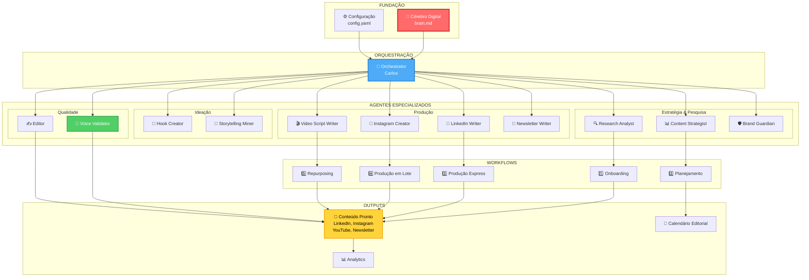

# Content Foundry

> Framework AI-First de Produção de Conteúdo para Founder-Led Marketing

[](https://github.com/vitorgarcia/content-foundry)
[](https://github.com/vitorgarcia/content-foundry)
[](LICENSE)

---

## O Que É

**Content Foundry** é um sistema de produção de conteúdo autêntico baseado em agentes de IA especializados. O framework captura a voz única do founder através de um "Cérebro Digital" profundo e gera conteúdo indistinguível da escrita manual.

**Diferencial:** Não é consultoria, é produção. Entrega conteúdo pronto para publicar.

---

## Por Que Content Foundry?

### O Problema
Founders têm conhecimento valioso e histórias autênticas, mas:
- ⏰ **Falta de tempo** - 12h/dia em operação, impossível criar conteúdo consistente
- 🔄 **Falta de consistência** - Posts esporádicos, sem estratégia clara
- 🤖 **Clone imperfeito** - IAs genéricas produzem conteúdo sem alma

### A Solução
- 🧠 **Cérebro Digital** - Captura profunda da voz, valores e histórias do founder
- 👥 **20 Agentes Especializados** - Trabalham em conjunto como uma equipe de marketing completa
- ✨ **Voice Score >= 8.5/10** - Validação rigorosa de autenticidade em cada conteúdo
- 🚀 **Produção Automatizada** - Do onboarding ao post publicável em minutos

---

## Arquitetura do Sistema



---

## Conceitos Principais

### 🧠 Cérebro Digital (`docs/brain.md`)

O coração do sistema. Um arquivo YAML + Markdown que contém:

- **Tom de voz** por canal (LinkedIn, Instagram, etc.)
- **Pilares de conteúdo** (temas principais)
- **Histórias pessoais** (jornada, fracassos, sucessos)
- **Valores e crenças**
- **Safe Mode** (conservador/balanced/bold)

> ⚠️ **CRÍTICO:** Protegido via `.gitignore` e `chmod 600` - nunca deve ser commitado em repositório público.

### 👥 Agentes Especializados

20 agentes trabalhando em conjunto, organizados por função:

| Categoria | Agentes | Função |
|-----------|---------|--------|
| **Orquestração** | Orchestrator, Elicitation Expert | Coordenação e captura de conhecimento |
| **Estratégia** | Research Analyst, Content Strategist, Brand Guardian, Audience Insights | Pesquisa e planejamento |
| **Ideação** | Hook Creator, Storytelling Miner | Criação de ganchos e histórias |
| **Produção** | LinkedIn Writer, Instagram Creator, Reels Writer, Video Writer, Newsletter Writer | Criação de conteúdo por canal |
| **Qualidade** | Editor, Voice Validator | Revisão e validação de autenticidade |
| **Otimização** | Repurposing Specialist, SEO Optimizer, Engagement Optimizer | Maximização de alcance |

### 🔄 Workflows

9 workflows principais que cobrem todo o ciclo de vida do conteúdo:

1. **Onboarding Inicial** - Criação do Cérebro Digital (60-90 min)
2. **Planejamento Estratégico** - Calendário editorial mensal
3. **Produção Express** - Post único rápido (15-20 min)
4. **Produção em Lote** - Múltiplos posts de uma vez
5. **Repurposing** - Adapta conteúdo entre canais
6. **Trend Jacking** - Surfar trends do momento
7. **Performance Review** - Análise de resultados
8. **Resgate de Consistência** - Retomada após pausa
9. **Atualização do Cérebro** - Evolução do founder

### 🎯 Jornadas Pré-Definidas

Sequências otimizadas para diferentes perfis:

- **Do Zero ao Primeiro Post** (60-90 min) - Para iniciantes
- **Profissionalização** (2-3h) - De inconsistente para consistente
- **Eficiência Multi-Canal** (4-6h) - Maximizar produtividade

---

## Estrutura do Projeto

```
content-foundry/
├── .content-foundry/          # Framework core
│   ├── agents/                # 20 agentes especializados
│   ├── workflows/             # 9 workflows principais
│   ├── jornadas/              # 3 jornadas pré-definidas
│   ├── tasks/                 # Tarefas reutilizáveis
│   ├── templates/             # Templates de outputs
│   ├── checklists/            # Validações de qualidade
│   ├── data/                  # Dados de referência
│   └── config.yaml            # Configuração global
│
├── docs/                      # Dados do founder
│   ├── brain.md               # 💎 Cérebro Digital (CRÍTICO)
│   ├── content/               # Conteúdos gerados
│   │   ├── linkedin/
│   │   ├── instagram/
│   │   ├── youtube/
│   │   └── newsletter/
│   ├── calendar.md            # Calendário editorial
│   └── insights-journal.md    # Banco de ideias
│
└── .foundry/                  # Runtime state (privado)
    ├── logs/                  # Logs de operações
    ├── backups/               # Backups do cérebro
    └── analytics.yaml         # Métricas internas
```

---

## Canais Suportados

### MVP v1.0

- ✅ **LinkedIn** - Posts, artigos, carrosséis
- ✅ **Instagram** - Feed, carrossel, Reels, Stories
- ✅ **YouTube** - Roteiros de vídeos
- ✅ **Newsletter** - Email marketing

### Futuros (v2.0)

- 🔜 TikTok
- 🔜 Blog/Website
- 🔜 Podcast
- 🔜 Twitter/X

---

## Como Funciona

### 1. Onboarding (Primeira Vez)

```bash
# Criar seu Cérebro Digital
/cf-onboarding
```

O sistema guia você através de perguntas estruturadas para capturar:
- Sua voz e tom
- Histórias pessoais
- Valores e crenças
- Pilares de conteúdo

**Resultado:** `docs/brain.md` com contexto profundo sobre você.

### 2. Gerar Primeiro Post

```bash
# Post rápido para LinkedIn
/cf-gerar-post-rapido linkedin "seu tópico"
```

O sistema:
1. Carrega 100% do seu Cérebro Digital
2. Gera 3 variações do post
3. Valida autenticidade (Voice Score >= 8.5/10)
4. Entrega conteúdo pronto para publicar

### 3. Validação de Qualidade

Cada conteúdo passa por:
- ✅ **Voice Score >= 8.5/10** - Autenticidade rigorosa
- ✅ **Brand Alignment** - Alinhado com seus valores
- ✅ **Safe Mode Check** - Respeita nível de ousadia configurado
- ✅ **Editorial Review** - Qualidade editorial

---

## Métricas de Sucesso

### Critérios MVP v1.0

- [x] Voice score >= 8.5/10 em todos os posts
- [x] Founder aprova 70%+ sem edições
- [x] Conteúdo indistinguível de escrita manual
- [x] 30 posts gerados em 4 semanas
- [x] Tempo médio de geração < 20s

### Qualidade Garantida

```yaml
validacao:
  voice_score_minimo: 8.5/10
  modo_profundidade: Deep (contexto máximo)
  anti_deteccao_ia: Ativado
  taxa_aprovacao_alvo: 70%+
```

---

## Comandos Principais

```bash
# Ajuda e Status
/cf-ajuda                      # Lista todos os comandos
/cf-status                     # Mostra status atual do sistema

# Produção de Conteúdo
/cf-gerar-post-rapido {canal} {tópico}     # Post único rápido
/cf-criar-calendario-mensal                # Planejamento mensal
/cf-repurposing {origem} {destino}         # Adapta entre canais

# Validação
/cf-validate-brain             # Valida estrutura do cérebro
/cf-voice-score {arquivo}      # Testa autenticidade de conteúdo

# Manutenção
/cf-backup-brain               # Backup do Cérebro Digital
/cf-atualizar-cerebro          # Atualiza informações do founder
```

---

## Segurança & Proteção

### Arquivos Críticos Protegidos

```yaml
arquivos_sensiveis:
  - docs/brain.md              # Histórias, valores (CRÍTICO)
  - docs/insights-journal.md   # Banco de ideias (SENSÍVEL)
  - .foundry/                  # Estado privado (PRIVADO)

protecao:
  - chmod 600 brain.md         # Apenas owner lê/escreve
  - .gitignore configurado     # Nunca commita dados sensíveis
  - Backup encrypted manual    # Backup seguro recomendado
```

### Onboarding Security Checklist

- [ ] `.gitignore` configurado
- [ ] `chmod 600` aplicado em arquivos sensíveis
- [ ] Founder ciente da privacidade dos dados
- [ ] Estratégia de backup definida

---

## Roadmap

### v1.0 (MVP - Atual) ✅

- Config-based framework
- Roda no Claude Code
- Single founder
- 4 canais (LinkedIn, Instagram, YouTube, Newsletter)
- 20 agentes especializados
- 9 workflows completos
- Validação interna

### v2.0 (Standalone - Futuro) 🔜

- Standalone app (Python/Node)
- Multi-founder support
- Web UI
- Cloud sync
- Mais canais (TikTok, Blog, Podcast, Twitter)
- API pública
- Integrações com redes sociais

---

## Tech Stack

```yaml
runtime:
  platform: Claude Code (Anthropic)
  llm: Claude Sonnet 4.5

configuration:
  format: YAML + Markdown
  storage: File system + Git

dependencies:
  none: Pure config-based (zero dependencies)
```

---

## Desenvolvido Por

**Vitor Garcia** - Product Owner & Founder
**Winston (BMad Architect)** - Arquiteto do Framework

Framework baseado no [BMad Method](https://bmad.ai).

---

## Contribuindo

Este é um projeto em desenvolvimento ativo. Contribuições são bem-vindas!

### Como Contribuir

1. Fork o projeto
2. Crie uma branch para sua feature (`git checkout -b feature/AmazingFeature`)
3. Commit suas mudanças (`git commit -m 'Add some AmazingFeature'`)
4. Push para a branch (`git push origin feature/AmazingFeature`)
5. Abra um Pull Request

---

## Licença

Este projeto está sob a licença MIT. Veja o arquivo [LICENSE](LICENSE) para mais detalhes.

---

## Status do Projeto

**Versão Atual:** 1.0.0 (MVP Config-Based)
**Status:** ✅ Em uso interno
**Próximo Marco:** Validação completa do MVP

---

<div align="center">

**[Documentação](./docs/)** • **[Arquitetura](./docs/architecture/)** • **[Stories](./docs/stories/)** • **[Epics](./docs/epics.md)**

---

Feito com ❤️ por founders, para founders.

</div>
